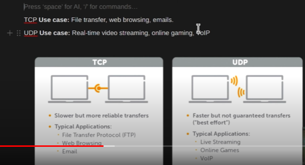
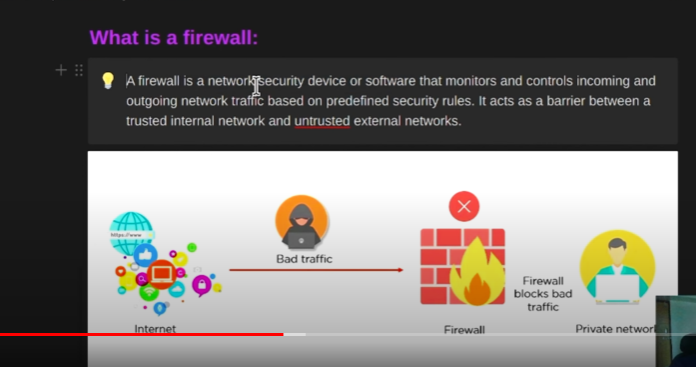

1. To list the processes running in linux machine - ps command
2. To check the running processes and kill - ps-aux command
3. To view CPU and RAM used by different processes - top or (htop) command.
4. SSH - Secure Shell is a secure way to remotely connect to and control Linux computers over the internet. It keeps your data safe through encryption and authentication.
5. To check memory "free" command is used.
6. Cronjob: cronjob is a scheduled task which allows us to automate the repititive tasks by specifying when and how often they should run.
7. Alias: Alias in linux is a custom shorthand for longer commands. It helps in reducing time and typing errors.
##### Networking questions
1. DNS: Domain name system translates human-readable domain names into IP address that computers use to identify eachother on the network.
10. NAT
11. TCP(Transmission Control Protocol) & UDP(User Datagram Protocol)

12. 7 layers of OSI
* physical layer
* data layer
* network layer
* transport layer
* session layer
* presentation layer
* application layer
13. Firewall: it is a network security device or software 

14. Ping command used to test network comnectivity by sending ICMP requests to target host to check the response time.
* ICMP: The Internet Control Message Protocol (ICMP) is a protocol that devices within a network use to communicate problems with data transmission.
15. ifconfig command