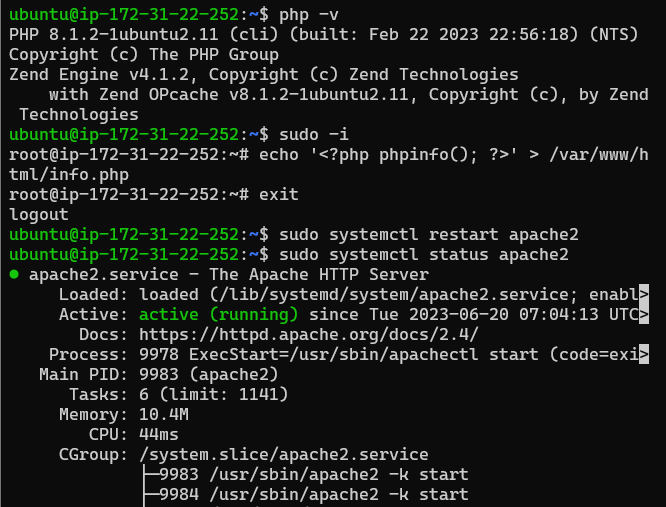
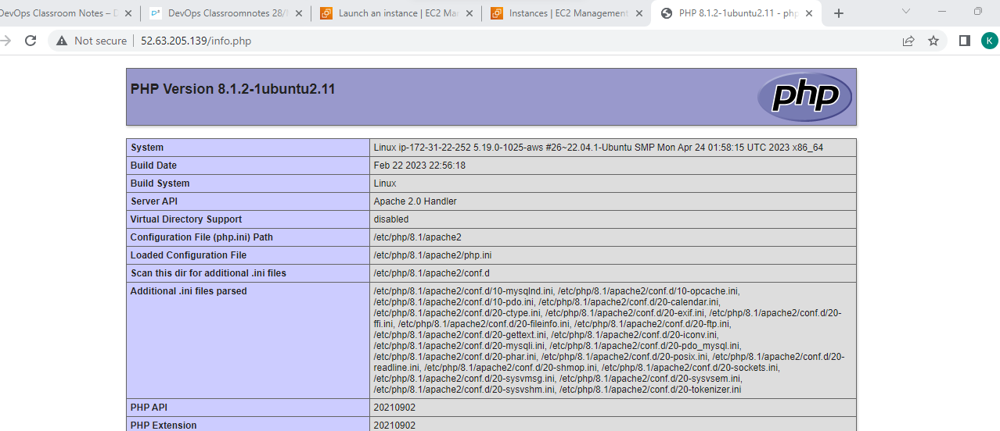

#### Ansible is a software tool that provides simple but powerful automation for cross-platform computer support
* There are two types of configuration managements.They are 
1. Push based configuration management:
* No agents are required.only login credentials are required to connect to nodes.
* Ansible
* Saltstack
2. Pull based configuration management:
* Agents are required to connect nodes.
* Chef
* Puppet
##### INVENTORY:
Inventory is a list of nodes.Number of nodes or machines which need to be connected to ansible control node or configured.
##### Ansible installation:
1. create a virtual machine and edit sshd_config file Enable password based authentication from no to yes.Then restart and add user hema.Then add user hema to sudoers with no passwd authentication.Exit and re-login with user name as hema.Check for python installed  or not.
```
sudo vi /etc/ssh/sshd_config
sudo service sshd restart
sudo adduser hema
sudo visudo (hema ALL=(ALL:ALL)NOPASSWD:ALL)
python3 --version
```
2. Install ansible in ansible control node
```
sudo apt update
sudo apt install software-properties-common -y
sudo add-apt-repository --yes --update ppa:ansible/ansible
sudo apt install ansible -y
```
3. Check whether ansible is installed or not by <ansible --version>
4. Create one more vm named as node1,create user with the same name as in control node 'hema'.edit config file by adding this user to config file and enable password based authentication from no to yes.
5. Now in the control node generate a key pair < ssh-keygen>
6. To connect node1  to control node,execute ssh-copy-id @(username)(private ip of node1)
7. To check whether connected or not run ssh(private ip of node1) you should be able to login to node1 from the control node.
* Add inventory with file name  < vi hosts> in control node and add ip address of node1. to check the cnnectivity.
```
ansible -i hosts -m ping all
```
#### ansible playbook
* [refer here](https://docs.ansible.com/ansible/latest/reference_appendices/YAMLSyntax.html) for yaml syntax
* [refer here](https://docs.ansible.com/ansible/latest/playbook_guide/playbooks.html#working-with-playbooks) for ansible playbook docs

### lamp
* A “LAMP” stack is a group of open source software that is typically installed together in order to enable a server to host dynamic websites and web apps written in PHP. This term is an acronym which represents the Linux operating system with the Apache web server. The site data is stored in a MySQL database, and dynamic content is processed by PHP.
* lamp:-linux,apache,mysql,php
#### Manual process:
```
sudo apt update
sudo apt install apache2 -y
sudo apt install php libapache2-mod-php php-mysql
sudo -i
echo '<?php phpinfo(); ?>' > /var/www/html/info.php
exit and relogin
sudo systemctl restart apache2

```


### By playbook
[Refer here](C:\Users\karam\OneDrive\Desktop\gitclassroompractice\gitpractice\ansible\playbooks) for lamp playbook
```
ansible-playbook -i <inventory-path> <playbook-path>
```