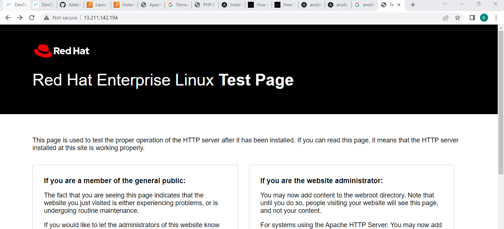

#### Ansible:
Ansible is a software tool that provides simple but powerful automation for cross-platform computer support
* Ansible is a tool written in Python, and it uses the declarative markup language YAML to describe the desired state of devices and configuration.
* Configuration Management:Configuration Management is the process of maintaining systems, such as computer hardware and software, in a desired state. 
* There are two types of configuration managements.They are 

1. Push based configuration management:
* No agents are required.only login credentials are required to connect to nodes.
##### Examples:
* Ansible
* Saltstack

2. Pull based configuration management:
* Agents are required to connect nodes.
##### Examples:
* Chefc
* Puppet

##### PLAYBOOK:
Playbooks are YAML files containing a list of ordered tasks that should be executed on a remote server to complete a task or reach a certain goal.
* Ansible playbooks allow you to fully automate server setup and application deployment, using an accessible syntax and an extensive library of built-in resources.

##### Ansible modules:
Ansible modules are units of code that can control system resources or execute system commands. Ansible provides a module library that you can execute directly on remote hosts or through playbooks. You can also write custom modules.

### Facts
Ansible collects information about the node on which it is executing by the help of module called as SETUP.

##### INVENTORY:
Inventory is a list of nodes.Number of nodes or machines which need to be connected to ansible control node or configured.
* An Ansible inventory is a collection of managed hosts we want to manage with Ansible for various automation and configuration management tasks
* Two types of inventories.

1. Static: we list the nodes to be connected to control node.
2. Dynamic: we write a script to choose which nodes should be connected.

##### ROLES:
In Ansible, the role is the primary mechanism for breaking a playbook into multiple files. This simplifies writing complex playbooks, and it makes them easier to reuse.

##### Ansible installation:
1. create a virtual machine and edit sshd_config file Enable password based authentication from no to yes.Then restart and add user hema.Then add user hema to sudoers with no passwd authentication.Exit and re-login with user name as hema.Check for python installed  or not.
```
sudo vi /etc/ssh/sshd_config
sudo service sshd restart
sudo adduser hema
sudo visudo (hema ALL=(ALL:ALL)NOPASSWD:ALL)
python3 --version
```
* To uninstall ansible `sudo apt-get remove ansible`
2. Install ansible in ansible control node
```
sudo apt update
sudo apt install software-properties-common -y
sudo add-apt-repository --yes --update ppa:ansible/ansible
sudo apt install ansible -y
```
3. Check whether ansible is installed or not by <ansible --version>
4. Create one more vm named as node1,create user with the same name as in control node 'hema'.edit config file by adding this user to config file and enable password based authentication from no to yes.
5. Now in the control node generate a key pair < ssh-keygen>
6. To connect node1  to control node,execute ssh-copy-id (username)@(private ip of node1)
7. To check whether connected or not run ssh(private ip of node1) you should be able to login to node1 from the control node.
* Add inventory with file name  < vi hosts> in control node and add ip address of node1. to check the cnnectivity.
```
ansible -i hosts -m ping all
```
#### ansible playbook
* [refer here](https://docs.ansible.com/ansible/latest/reference_appendices/YAMLSyntax.html) for yaml syntax
* [refer here](https://docs.ansible.com/ansible/latest/playbook_guide/playbooks.html#working-with-playbooks) for ansible playbook docs

### lamp
* A “LAMP” stack is a group of open source software that is typically installed together in order to enable a server to host dynamic websites and web apps written in PHP. This term is an acronym which represents the Linux operating system with the Apache web server. The site data is stored in a MySQL database, and dynamic content is processed by PHP.
* lamp:-linux,apache,mysql,php
#### In Ubuntu
#### Manual process:
```
sudo apt update
sudo apt install apache2 -y
sudo apt install php libapache2-mod-php php-mysql
sudo -i
echo '<?php phpinfo(); ?>' > /var/www/html/info.php
exit and relogin
sudo systemctl restart apache2
```


### By playbook:
```
---
- name: installing lamp server on ubuntu
  hosts: all
  become: true
  tasks:
    - name: update packages and install apache
      ansible.builtin.apt:
        name: apache2
        state: present
        update_cache: yes
    - name: install php packages
      ansible.builtin.apt:
        name:
          - php
          - libapache2-mod-php
          - php-mysql
        state: present
    - name: copy info.php page
      ansible.builtin.copy:
        content: '<?php phpinfo(); ?>'
        dest: /var/www/html/info.php
    - name: restart apache2
      ansible.builtin.systemd:
        name: apache2
        state: restarted
```
```
ansible-playbook -i inventory/hosts playbooks/ubuntu.yaml
```


#### In Redhat
#### Manual process:
```
sudo yum install httpd -y
sudo systemctl enable httpd
sudo systemctl start httpd
sudo yum install php -y
sudo systemctl restart httpd
sudo -i
echo '<?php phpinfo(); ?>' > /var/www/html/info.php
exit
sudo systemctl restart httpd
```


#### By Playbook:
* Installing ansible in redhat
```
curl https://bootstrap.pypa.io/get-pip.py -o get-pip.py
python3 get-pip.py --user
python3 -m pip install --user ansible
python3 -m pip install --user ansible-core==2.12.3
python3 -m pip install --upgrade --user ansible
ansible --version
python3 -m pip show ansible
```
* take ansible control node and node1 as redhat machine.
```
---
- name: installing lamp server on redhat
  hosts: all
  become: true
  tasks:
    - name: update packages and install httpd
      ansible.builtin.yum:
        name: httpd
        state: present
    - name: enable and start httpd
      ansible.builtin.systemd:
        name: httpd
        enabled: yes
        state: restarted
    - name: install php server
      ansible.builtin.yum:
        name: php
        state: present
    - name: copy info.php page
      ansible.builtin.copy:
        content: '<?php phpinfo(); ?>'
        dest: /var/www/html/info.php
    - name: restart httpd
      ansible.builtin.systemd:
        name: httpd
        state: restarted
```





### Nginx
* Manual process:


* By playbook:
```
---
name: install nginx
hosts: all
become: yes
tasks:
  - name: update packages andinstall nginx
    ansible.builtin.apt:
      - name: nginx
        state: present
        update_cache: yes
```

### Anisble handlers
Sometimes you want a task to run only when a change is made on a machine. For example, you may want to restart a service if a task updates the configuration of that service, but not if the configuration is unchanged. Ansible uses handlers to address this use case. Handlers are tasks that only run when notified.