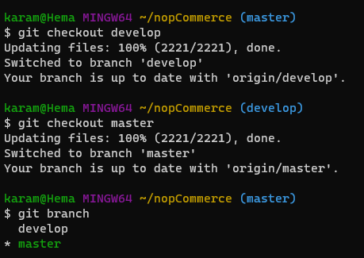
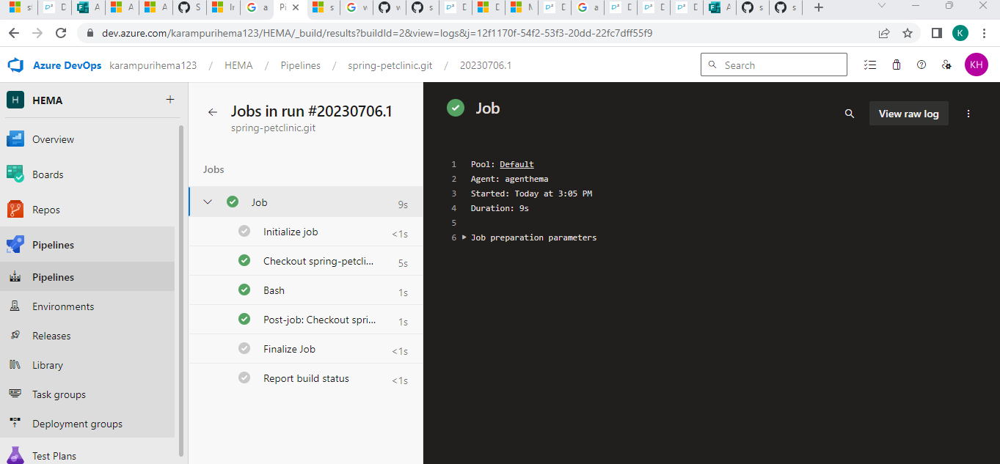
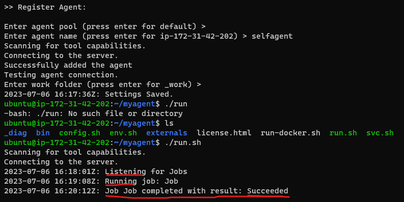
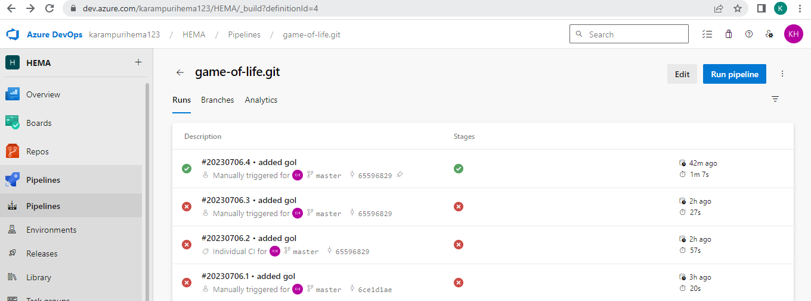

### AZURE DEVOPS
##### Azure DevOps, a modern DevOps tool of planning, developing, testing and deploying modern apps with optimized release cycle for quality delivery of applications. Azure DevOps provides a tool which can help you to track software building progress and help you to take decision to deliver great software to end users. Azure DevOps services are not dependent on cloud or platform. Azure DevOps includes the following services :

* Azure DevOps includes Git repositories as source control, build and release management tools, work planning and tracking tools, testing tools and support services like Slack, Trello and Azure services.
(or)
##### Azure DevOps supports a collaborative culture and set of processes that bring together developers, project managers, and contributors to develop software. It allows organizations to create and improve products at a faster pace than they can with traditional software development approaches.
### Azure Pipelines (Build and Release)
Azure Pipeline is a cloud-hosted pipelines for fast CI/CD that works with any language, platform, and cloud. By connecting to any source control like GitHub, this service can release changes continuously to any cloud. YAML files are very useful in writing build and release definitions. Azure Pipelines has components like build, release, library, task groups, deployment groups. Azure Pipelines has advance workflows with native container support and features which allow monitoring CI/CD stages.
* [Refer Here](https://www.dotnettricks.com/learn/devops/introduction-to-azure-devops) for official docs on Azure-DevOps.

### GIT: 
Git is a free open source distributed version control system that tracks changes in any set of computer files, usually used for coordinating work among programmers collaboratively developing source code during software development. Its goals include speed, data integrity, and support for distributed, non-linear workflows.
* Git is a DevOps tool used for source code management.

#### We can change from one branch to other by "git checkout" command.


* By default it shows only local branches.After chekout to master it shows to two branches.
* Each branch have remote name and origin as {remotename/origin}
* we can check them by command `git branch -r`

### AZURE-DEVOPS PIPELINES:
Azure Pipelines automatically builds and tests code projects. It supports all major languages and project types and combines continuous integration, continuous delivery, and continuous testing to build, test, and deliver your code to any destination.
* To write pipelines we use YAML schema reference for Azure Pipelines.
* The YAML schema reference for Azure Pipelines is a detailed reference for YAML pipelines that lists all supported YAML syntax and their available options.
* [Refer Here](https://learn.microsoft.com/en-us/azure/devops/pipelines/yaml-schema/?view=azure-pipelines) for writing pipelines using YAML schema reference.
* A pipeline is one or more stages that describe CI/CD process.
* stages are collection of jobs.
* Jobs are collection of steps.

1. A pipeline is one or more stages that describe a CI/CD process. Stages are the major divisions in a pipeline. The stages "Build this app," "Run these tests," and "Deploy to preproduction" are good examples.

2. A stage is one or more jobs, which are units of work assignable to the same machine. You can arrange both stages and jobs into dependency graphs. Examples include "Run this stage before that one" and "This job depends on the output of that job."
3. A job is a linear series of steps. Steps can be tasks, scripts, or references to external templates.

* POOL: where do you want to run the job.
* What is a POM? A Project Object Model or POM is the fundamental unit of work in Maven. It is an XML file that contains information about the project and configuration details used by Maven to build the project. It contains default values for most projects.
* sample yaml
```
---
trigger:
  - master
pool: ubuntu-latest
stages:
  - stage: buildstage1
    displayName: buildstage1
    jobs:
      - job: buildcode
        displayName: buildcode
        steps:
          - task: Maven@4
            inputs:
              mavenPOMFile: 'pom.xml'
              goals: package
```
#### If we have only one stage,means collection of jobs.we should not write stage here,directly write jobs.
```
---
name: hema
trigger:
  - master
pool: ubuntu-latest
jobs:
  - job: buildcode
    displayName: buildcode
    steps:
      - task: Maven@4
        inputs:
          mavenPOMFile: 'pom.xml'
          goals: package
```
#### If we have only one job,it means collection of steps.We shouldn't write job,directly write steps.
---
name: hema
trigger:
  - master
pool: ubuntu-latest
steps:
  - task: Maven@4
    inputs:
      mavenPOMFile: 'pom.xml'
      goals: package

#### Creating self-hosted agent




#### GAME OF LIFE
* To run game-of-life we require java version 8,and maven for building and packaging the code.
```
sudo apt update
sudo apt install openjdk-8-jdk maven -y
```
* Now create a new agent in azure-devops account.Go to project settings > agent pools > Default > new agent.


* In az-devops organization add a git repository of gol from web,then git clone ssh in terminal and check for git branch.

* Go to terminal and git clone the url of corresponding application,connect to vs code and write a pipeline for game-of-life.Then run the pipeline.
```
trigger:
  - master
  
pool:
  name: Default
steps:
  - task: Maven@3
    inputs:
      mavenPOMFile: 'pom.xml'
      displayName: GOL Pipeline
      goals: package
      publishJUnitResults: true
      testResultsFiles: '**/surefire-reports/TEST-*.xml'
      testRunTitle: unittests
```






#### Nop commerce
