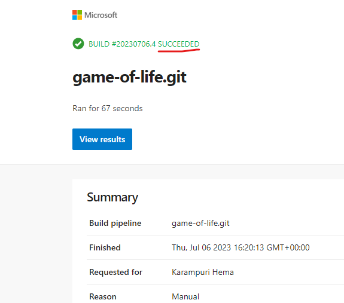
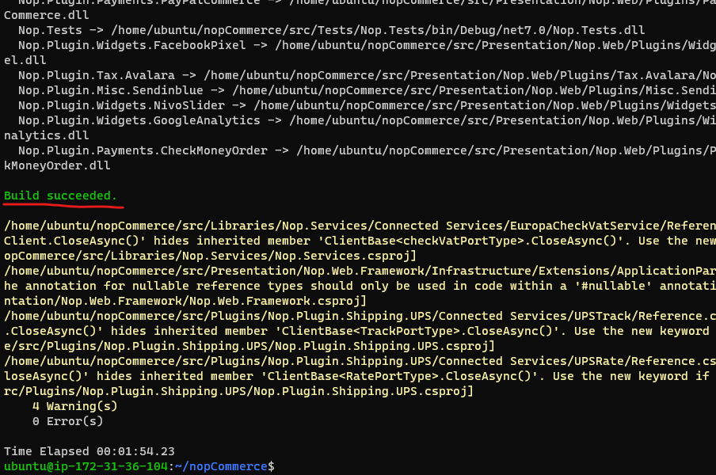
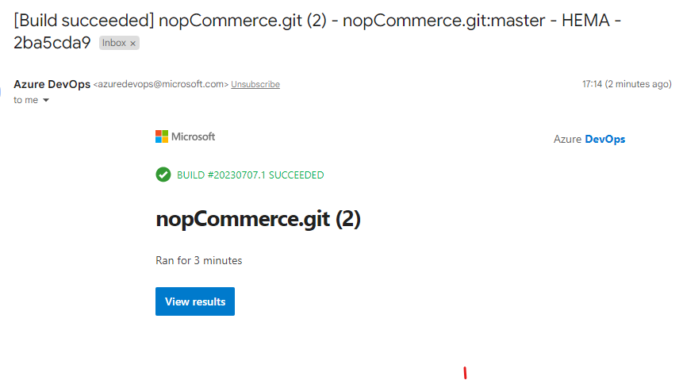

#### Creating self-hosted agent


## GAME OF LIFE
* To run game-of-life we require java version 8,and maven for building and packaging the code.
```
sudo apt update
sudo apt install openjdk-8-jdk maven -y
```
* Now create a new agent in azure-devops account.Go to project settings > agent pools > Default > new agent.


* In az-devops organization add a git repository of gol from web,then git clone ssh in terminal and check for git branch.

* Go to terminal and git clone the url of corresponding application,connect to vs code and write a pipeline for game-of-life.Then run the pipeline.
```
trigger:
  - master
  
pool:
  name: Default
steps:
  - task: Maven@3
    inputs:
      mavenPOMFile: 'pom.xml'
      displayName: GOL Pipeline
      goals: package
      publishJUnitResults: true
      testResultsFiles: '**/surefire-reports/TEST-*.xml'
      testRunTitle: unittests
```




## NopCommerce
* Manual steps:
* Nop commerce requires .net7
```
sudo apt-get update && \
sudo apt-get install -y dotnet-sdk-7.0
git clone https://github.com/nopSolutions/nopCommerce.git
cd nop commerce
git checkout master
dotnet restore src/NopCommerce.sln
dotnet build src/NopCommerce.sln
```



#### NOPcommerce PIPELINE

* In ec2 install .net7 and add agent then connect.
* In terminal gitclone nop url,then from there open vs code,create a file for pipelines and write nop pipeline.

```
trigger:
  - master

pool:
  name: Default
steps:
  - task: DotNetCoreCLI@2
    inputs:
      command: restore
      projects: src/NopCommerce.sln
  - task: DotNetCoreCLI@2
    inputs:
      command: build
      projects: src/NopCommerce.sln
```


