### Create an alpine container in interactive mode and install python
* manual process:
* <docker container run -it --name alpine1 alpine:latest>
* <apk --update upgrade>
* <apk add python3>
* <python3 --version>
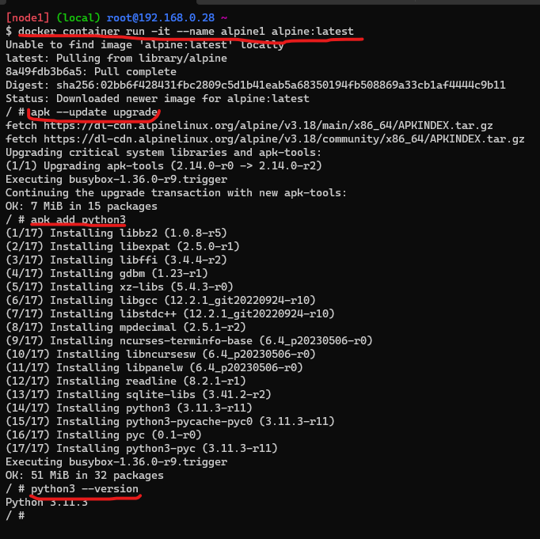
* By using dockerfile
* create a dockerfile with
* ---
* FROM alpine:latest
  LABEL author="hema" organization="hs"docker container exec -it postdata /bin/bash
  RUN apk --update upgrade
  RUN apk add python3
  CMD ["python3 --version"]
* ---
* 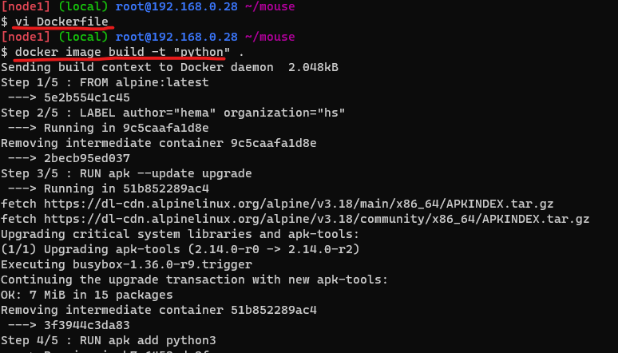
* Then build the image
* <docker image build -t "python" .>
* check for the version
* <python3 --version>
 ### Create a ubuntu container with sleep 1d and then login using exec and install python
* <docker container run -d --name hema ubuntu:latest sleep 1d>
* <docker container exec -it hema /bin/bash>
* <apt update && apt upgrade -y>
* <apt install python3>
* <python3 --version>
* 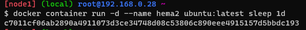
* 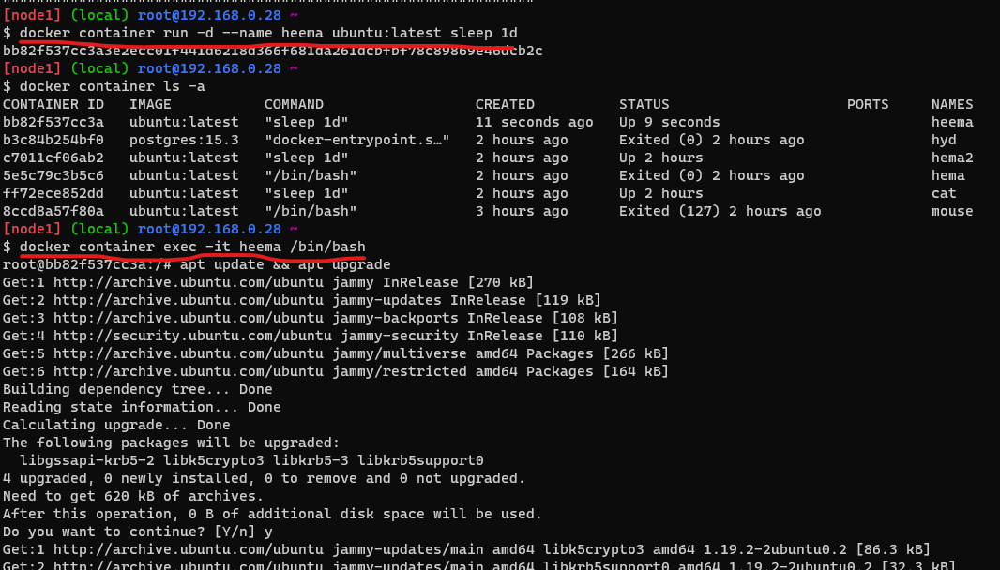
* 
* ### Create a postgres container with username panoramic and password as trekking. Try logging in and show the databases (query for psql)
* 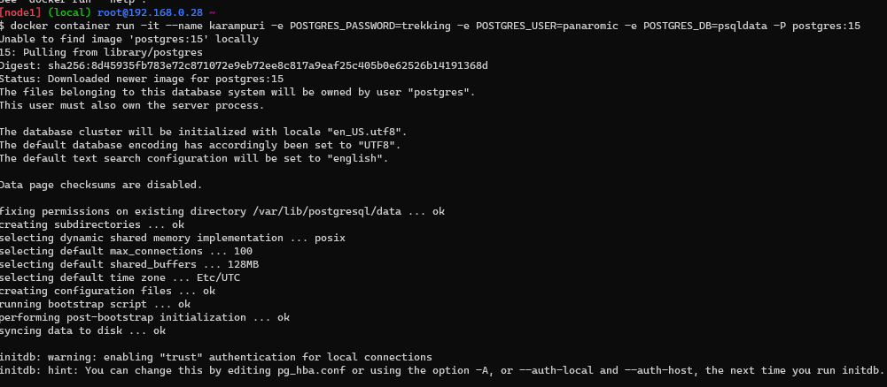

* ### Try to create a docker file which runs php info page, use ARG and ENV wherever appropriate on Apache & nginx
* Apache
* create a docker file with ARG & ENV for Apache 
* <FROM ubuntu:22.04
LABEL author="hema" organization="hs"
ARG DEBIAN_FRONTEND=noninteractive
RUN apt update && apt install apache2 -y
RUN apt install php libapache2-mod-php -y
RUN echo "<?php phpinfo() ?>" >> /var/www/html/info.php
EXPOSE 80
CMD ["apache2ctl","-D","FOREGROUND"]>
* <docker image build -t apache .>
* < docker container run -d --name php -P apache>
* 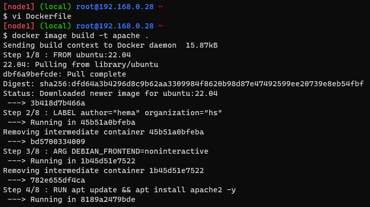
* 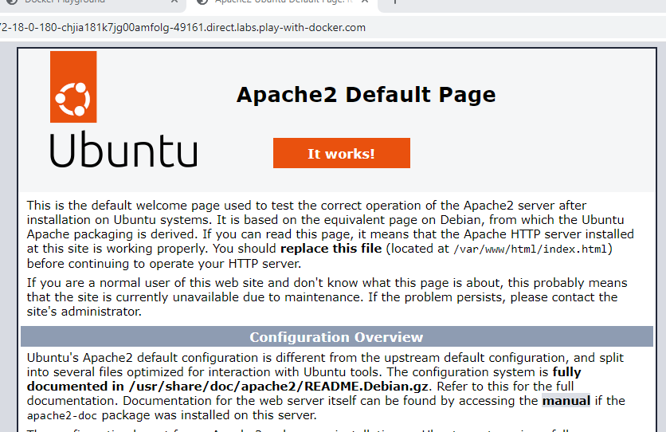
* after opening apache default page enter '/info.php'in the apache url
* 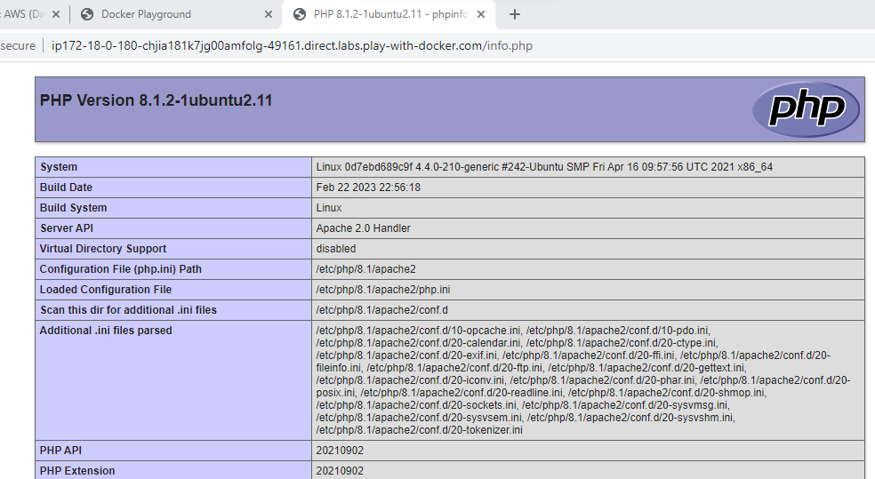

* ### Create a Jenkins image by creating an own docker file
* refer here for jenkins docs.
* <https://www.jenkins.io/doc/book/installing/linux/>
* dockerfile
* <FROM ubuntu:22.04 
LABEL author="hema" organization="hs"
RUN apt update && apt install openjdk-11-jdk maven curl -y
RUN curl -fsSL https://pkg.jenkins.io/debian-stable/jenkins.io-2023.key | tee \
   /usr/share/keyrings/jenkins-keyring.asc > /dev/null
RUN echo deb [signed-by=/usr/share/keyrings/jenkins-keyring.asc] \
  https://pkg.jenkins.io/debian-stable binary/ | tee \
  /etc/apt/sources.list.d/jenkins.list > /dev/null
RUN apt-get update
RUN apt-get install jenkins -y
EXPOSE 8080
CMD ["/usr/bin/jenkins"]>
* <docker image build -t jenkins .>
* 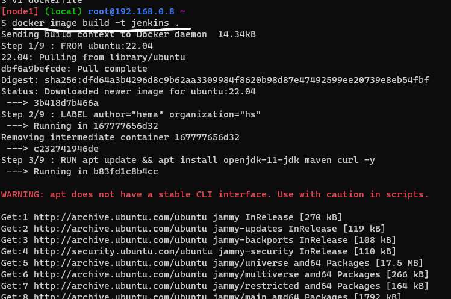
* <docker conatainer run -d --name hema -P jenkins>
* 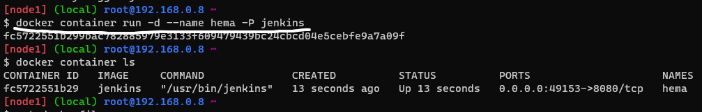
* 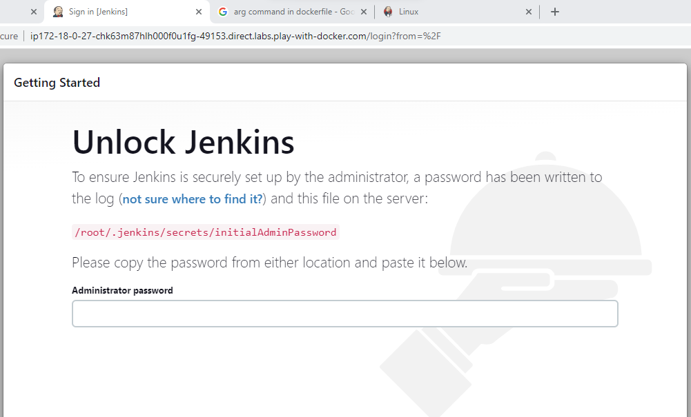
