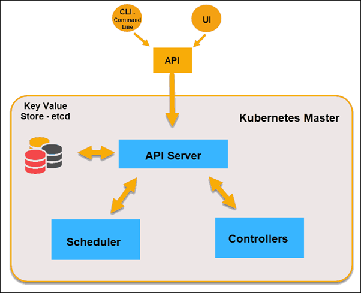
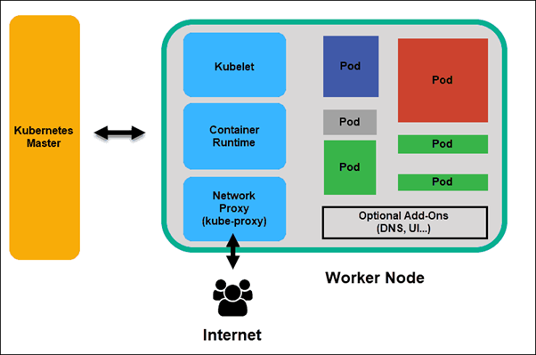

# KUBERNETES
## What is Kubernetes
Kubernetes or k8s is an orchestrator to build, deploy, update, and manage containers. A container is a standard unit of software that packages up code and all dependencies, so the application runs quickly and reliably from one computing environment to another.
* kubernetes can be described as production grade container management.
### Advantages of using kubernetes:-
1. Zero Downtime Deployment: Kubernetes has promoted zero-downtime updates of deployed models. In other words, the modeling service would not be interrupted by the update and it will continue to process requests without error. Updates are performed in a staged manner to ensure that the application is not impacted.
2. Auto Scaling: Kubernetes provides auto-scaling features. Meaning that, if there is load on the application, it auto scales as per the configurations set by the admin
3. Load balancing: A load balancer serves as the single point of contact for clients. The load balancer distributes incoming application traffic across multiple targets, such as EC2 instances, in multiple Availability Zones. This increases the availability of your application.
4. High Availability: Microservices and Kubernetes provide high availability of the system
5. Container Orchestration: Microservices fully support Container Orchestration and Kubernetes provide a good interface to manage it
6. Automated Scheduling: We can schedule automated deployments for frequent builds
7. Fault Tolerance: This feature of Kubernetes help us in any disaster happens with the container, if one container/pod goes down it will automatically create new pod and make it available for the users
8. Centralized Logging & Monitoring: Kubernetes provides Centralized Logging & Monitoring systems which help us to debug and monitor the issues and warnings
9. Configuration Management: Centralized Config management helps in managing microservices at one place
10. Automated Rollouts and rollback: It helps in deployments and rolling back the deployments in case of any problems in deployment.K8s can handle rollout (new version) and roll back (undo new version => previous version)
* It has many options for controlling and managing pods and containers including Deployments, StatefulSets, ReplicaSets, etc. Each of these elements has a distinct purpose, with the common goal of ensuring that pods operate constantly. Just like the other features of k8s, Jobs & Cronjobs are also part of that list.
### Distributed System:
A distributed system is simply a collection of components networked across multiple computers. The components are independent (or at least should be), can fail without impacting other services, and work concurrently.
### Node:
A Kubernetes node is a worker machine that runs Kubernetes workloads. It can be a physical (bare metal) machine or a virtual machine.
* Each Node is managed by the control plane. A Node can have multiple pods, and the Kubernetes control plane automatically handles scheduling the pods across the Nodes in the cluster.
### Cluster:
A Kubernetes cluster consists of a set of worker machines, called nodes, that run containerized applications. Every cluster has at least one worker node. 
* The worker node host the Pods that are the components of the application workload. The control plane manages the worker nodes and the Pods in the cluster.
### State:
There are three possible container states: Waiting , Running , and Terminated . To check the state of a Pod's containers, you can use kubectl describe pod <name-of-pod> . The output shows the state for each container within that Pod
### Stateful Applications:
Stateful applications save data to persistent disk storage for use by the server, by clients, and by other applications. An example of a stateful application is a database or key-value store to which data is saved and retrieved by other applications.
* If the webserver stores data in a backend manner and uses it to identify the user as an always-connected client, the service is Stateful. 
### Stateless Applications:
Stateful applications like the Cassandra, MongoDB and mySQL databases all require some type of persistent storage that will survive service restarts.Stateless applications don’t “store” data.
### Monolith:
The word monolith means something that is created or composed in one piece. Similarly, a monolithic architecture suggests a single-tiered application where all different components from a single platform can be combined and used for a single program. In this architecture, there can be different components and services but the application is created and deployed as a single application for all platforms.
### Microservices
It is a development technique that uses multiple loosely coupled services and serves as an application. The protocols and services used in this architectures are lightweight and fine-grained. This architecture supports parallel development and allows small autonomous teams to develop different services independently.
### Desired State:
The desired state is the state in which you want your application to be running. This state includes all the necessary resources, such as pods, services, and deployments. Kubernetes maintains the desired state by constantly comparing the current state of the system to the desired state and making changes as necessary.
* For example, suppose you have a deployment that specifies three replicas of your application. If one of the pods crashes, Kubernetes will automatically spin up a new pod to maintain the desired state of three replicas. This process ensures that your application is always running as expected, regardless of the changes that occur in the environment.
Declarative vs Imperative
### Pet Vs Cattle:
In Kubernetes Deployment, we treat our pods like cattle, not like pets. If one of the cattle members gets sick or dies, we can easily replace it by purchasing a new head. Such an action is not noticeable. Similarly, if one pod goes down in deployment, it brings up another one.
## K8s Architecture

## Master node
The master node controls and manages a set of worker nodes and contains the Kubernetes cluster. We can talk to the master node via CLI, GUI, or API, and more than one master node can be used for fault tolerance. Kubernetes uses the etcd, and all master nodes are connected to etcd, which is a distributed key-value store.
### API Server
API servers perform all administrative tasks on the master nodes. Users send the command to the API server, which then validates the request process and executes them. The API server determines if the request is valid or not and then processes it.

### Controller
The role of the Controller is to obtain the desired state from the API Server. It checks the current state of the nodes it is tasked to control, and determines if there are any differences, and resolves them if any.
#### cloud controller manager
A cloud controller is a storage appliance that automatically moves data from on-premises storage to cloud storage. Cloud controllers use hard disk drives, solid-state drives or a combination of the two to store data on-premises.
#### controller manager
The Kubernetes controller manager is a daemon that embeds the core control loops shipped with Kubernetes.

### Key-Value Store (etcd)
Etcd is an open-source distributed Key-Value Store used to hold and manage the critical information that distributed systems need to keep running. The Key-Value Store, also called etcd, is a database Kubernetes uses to back up all cluster data. It stores the entire configuration and state of the cluster.

### Scheduler
The Scheduler’s main job is to watch for new requests coming from the API Server and assign them to healthy nodes. It ranks the quality of the nodes and deploys pods to the best-suited node.
## Worker Node
Nodes have the following components:-
Worker nodes listen to the API Server for new work assignments; they execute the work assignments and then report the results to the Kubernetes Master node.

### Kubelet
Agent that runs on nodes in the cluster waiting for instructions from master and execute them. It is the principal Kubernetes agent. By installing kubelet, the node’s CPU, RAM, and storage become part of the broader cluster. It watches for tasks sent from the API Server, executes the task, and reports back to the Master.
### Container Runtime
This is technology in which your container is created (docker, rkt, containerd).The container runtime pulls images from a container image registry and starts and stops containers. A 3rd party software or plugin, such as Docker, usually performs this function.
### Kube-proxy
The kube-proxy makes sure that each node gets its IP address & is responsible for networking.
### Pod
A pod is the smallest element of scheduling in Kubernetes. Without it, a container cannot be part of a cluster.

### Kubernetes Services
One of the best features Kubernetes offers is that non-functioning pods get replaced by new ones automatically. The new pods have a different set of IPs. It can lead to processing issues and IP churn as the IPs no longer match. If left unattended, this property would make pods highly unreliable.
## Container Deployment

### Traditional Deployment
Initially, developers deployed applications on individual physical servers. This type of deployment posed several challenges. The sharing of physical resources meant that one application could take up most of the processing power, limiting the performance of other applications on the same machine.

It takes a long time to expand hardware capacity, which in turn increases costs. To resolve hardware limitations, organizations began virtualizing physical machines.
### Virtualized Deployment
Virtualized deployments allow you to scale quickly and spread the resources of a single physical server, update at will, and keep hardware costs in check. Each VM has its operating system and can run all critical systems on top of the virtualized hardware.

### Container Deployment
Container Deployment is the next step in the drive to create a more flexible and efficient model. Much like VMs, containers have individual memory, system files, and processing space. However, strict isolation is no longer a limiting factor. Multiple applications can now share the same underlying operating system. This feature makes containers much more efficient than full-blown VMs. They are portable across clouds, different devices, and almost any OS distribution.

The container structure also allows for applications to run as smaller, independent parts. These parts can then be deployed and managed dynamically on multiple machines. The elaborate structure and the segmentation of tasks are too complex to manage manually.
### Jobs & cronjobs:
A CronJob creates Jobs on a repeating schedule.Jobs are used for one-time or finite tasks that run to completion, while CronJobs are used for running a task on a recurring schedule.
### Pod lifecycle
1. Pending: The Kubernetes system accepts the Pod, but doesn’t create one or more of the Container images. This includes time spent prior to being scheduled as well as time spent downloading images over the network, which may take some time.
2. Running: The Pod associates with a node, and then creates all containers. At least one Container is still active or is in the process of being started or restarted.
3. Succeeded: All Containers in the Pod successfully terminates and will not restart.
4. Failed: All Containers in the Pod have terminated, and at least one of them has failed. That is, either the Container exited with a non-zero status or the system terminated it.
5. Unknown: The state of the Pod is unknown for some reason, most likely due to a communication error with the Pod’s host.

### Pod Conditions:
The phase of a pod says little about the condition of the pod. The main pod conditions are:
1. PodScheduled: Shows whether or not the pod has been scheduled to a node.
2. Initialized: The pod’s init containers have all completed successfully.
3. ContainersReady: All containers in the pod indicate that they are ready.
4. Ready: The pod is ready to provide services to its clients.
Kubernetes tracks the state of each container within a Pod in addition to the overall phase of the Pod. Container lifecycle hooks can trigger events at specific points in a container’s lifecycle.
### Container States:
* While looking into Kubernetes Pod States, we also need to know about Container States. Once a Node assigns a Pod by the scheduler, the kubelet begins creating containers for that Pod using a container runtime. Waiting, Running, and Terminated are the three possible container states.
1. Waiting: A container is Waiting if it is not in the Running or Terminated states. A container in the Waiting state is still performing the operations necessary for it to complete startup.
2. Running: The Running status indicates that a container is running normally.
3. Terminated: A container in the Terminated state started execution and then either finished or failed for some reason.