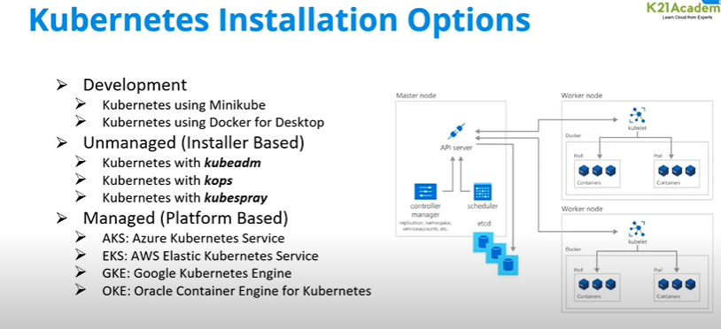

### kubernetes installation options:

### k8s installation
* Install docker in both the nodes,master & worker nodes
* To install the latest stable versions of Docker CLI, Docker Engine, and their
dependencies:
* 1. download the script
* <curl -fsSL https://get.docker.com -o install-docker.sh>
* 2. verify the script's content
* <cat install-docker.sh>
* 3. run the script with --dry-run to verify the steps it executes
* <sh install-docker.sh --dry-run>
* 4. run the script either as root, or using sudo to perform the installation.
* <sudo sh install-docker.sh>

* Add user to the group
* <sudo usermod -aG docker ubuntu(username)>
* Exit and re login
* <exit>
* check if the docker is working or not
* <docker info>

* Installing CRI-dockerd
* Run the below commands as root user
* <sudo -i>

* Installing go language
* <wget https://storage.googleapis.com/golang/getgo/installer_linux>
* <chmod +x ./installer_linux>
* <./installer_linux>
* <source /root/.bash_profile>
* <git clone https://github.com/Mirantis/cri-dockerd.git>
* <cd cri-dockerd>
* <mkdir bin>
* <go build -o bin/cri-dockerd>
* <mkdir -p /usr/local/bin>
* <install -o root -g root -m 0755 bin/cri-dockerd /usr/local/bin/cri-dockerd>
* <cp -a packaging/systemd/* /etc/systemd/system>
* <sed -i -e 's,/usr/bin/cri-dockerd,/usr/local/bin/cri-dockerd,' /etc/systemd/system/cri-docker.service
systemctl daemon-reload>
* <systemctl daemon-reload>
* <systemctl enable cri-docker.service>
* <systemctl enable --now cri-docker.socket>

* Installing kubeadm,kubectl,kubelet:-
* Kubeadm:th command to bootstrap the cluster
kubelet:the component thqat runs on all of the machines in your cluster and does thingd like starting pods and containers.
kubectl:the command line until you talk to your cluster.
* 1.Update the apt package index and install packages needed to use the Kubernetes apt repository:
* <sudo apt-get update>
* <sudo apt-get install -y apt-transport-https ca-certificates curl>
* 2.Download the Google Cloud public signing key:
* <curl -fsSL https://packages.cloud.google.com/apt/doc/apt-key.gpg | sudo gpg --dearmor -o /etc/apt/keyrings/kubernetes-archive-keyring.gpg>
* 3.Add the kuberenetes apt repository:
* <echo "deb [signed-by=/etc/apt/keyrings/kubernetes-archive-keyring.gpg] https://apt.kubernetes.io/ kubernetes-xenial main" | sudo tee /etc/apt/sources.list.d/kubernetes.list>
* 4.Update apt package index, install kubelet, kubeadm and kubectl, and pin their version:

* <sudo apt-get update>
* <sudo apt-get install -y kubelet kubeadm kubectl>
* <sudo apt-mark hold kubelet kubeadm kubectl>
* Now create a cluster from a master node
* <mkdir -p $HOME/.kube>
  <sudo cp -i /etc/kubernetes/admin.conf $HOME/.kube/config>
  <sudo chown $(id -u):$(id -g) $HOME/.kube/config>

* <kubeadm init --pod-network-cidr "10.244.0.0/16" --cri-socket "unix:///var/run/cri-dockerd.sock">
* Install flanell:-flannel is an overlay network provider that can be used with kubernetes
* <kubectl apply -f https://github.com/flannel-io/flannel/releases/latest/download/kube-flannel.yml>

* execute the below command as a root user & run kubeadm join commands in the node to connect to master node(need to pass crisocket)
* <kubeadm join 172.31.30.147:6443 --token vhng3g.80ar2wxm8hjb84hu \
  --cri-socket "unix:///var/run/cri-dockerd.sock" \
--discovery-token-ca-cert-hash sha256:aff8046ad5bf2d274665c08d878ce5f2df9746b2f334c64642ab4a735c943be8>
* Now from manager execute <kubectl get nodes>

