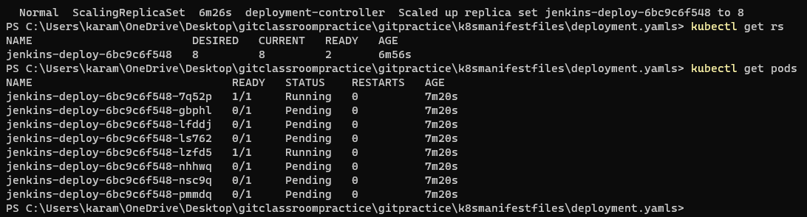

### Kubernetes api resources


### Kuberenetes controllers:

* connect the kubernetes cluster to azure cli
```
 az aks get-credentials --resource-group k8s --name k8scluster
```
### creating pod with
1. nginx
2. nginx & alpine with sleep 1d
3. nginx & alpine with sleep 1d & alpine with sleep 10 sec
4. nginx & httpd with 80 port exposed


### replication controller:
* A ReplicationController is responsible for managing the pod lifecycle and ensuring that the specified number of pods required are running at any given time. 
* If there are too many pods, the ReplicationController terminates the extra pods. If there are too few, the ReplicationController starts more pods. Unlike manually created pods, the pods maintained by a ReplicationController are automatically replaced if they fail, are deleted, or are terminated.
##### replicaset nginx pod without selectors:
```
---
apiVersion: apps/v1
kind: ReplicaSet
metadata:
  name: rsnginx
spec:
  minReadySeconds: 1
  replicas: 3
  template:
    metadata:
      name: rspod
    spec:  
      containers:
        - name: nginx
          image: nginx:1.25
          ports:
            - containerPort: 80
```            

##### replicaset nginx pod with selectors:
```
---
apiVersion: apps/v1
kind: ReplicaSet
metadata:
  name: rsnginx
  labels:
    app: nginx
spec:
  minReadySeconds: 1
  replicas: 3
  selector:
    matchLabels:
      app: nginx
  template:
    metadata:
      name: rspod
      labels:
        app: nginx
    spec:  
      containers:
        - name: nginx
          image: nginx:1.25
          ports:
            - containerPort: 80
```

#### To describe the replicaset
```
kubectl describe rs rsnginx
```

* Now delete all the three pods and then check number of pods

* We can see three new pods created as number of replicasets are 3.
#### we can scale the number of pods using the command
```
kubectl scale --replicas=4 rs/rsnginx
```  

* creating replicaset jenkins with 5 pods & alpine with 1 pod
```
---
apiVersion: apps/v1
kind: ReplicaSet
metadata:
  name: jenkins-rs
spec:
  minReadySeconds: 5
  replicas: 5
  selector:
    matchLabels:
      app: jenkins
  template:
    metadata:
      name: jenkins
      labels:
        app: jenkins
    spec:
      containers:
        - name: jenkins
          image: jenkins/jenkins:lts-jdk11
          ports:
            - containerPort: 8080
        - name: alpine
          image: alpine:3
          args:
            - sleep
            - 1d
```
```
kubectl apply -f rs-jenkins.yaml
```


* now delete one pod and describe replicaset


#### creating nginx pod with label


#### creating a replicaset,service file for nginx and alpine pod
* alpinepod.yaml
```
---
apiVersion: v1
kind: Pod
metadata:
  name: alpine
spec:
  containers:
    - name: alpine
      image: alpine
      command:
        - sleep
        - 1d
```
* nginx-rs.yaml
```
---
apiVersion: apps/v1
kind: ReplicaSet
metadata:
  name: nginx-rs
  labels:
    app: nginx
    layer: web
    version: "1.23"
spec:
  minReadySeconds: 1
  replicas: 2
  selector:
    matchLabels:
      app: nginx
  template:
    metadata:
      name: nginx
      labels:
        app: nginx
        version: "1.23"
    spec:
      containers:
        - name: nginx
          image: nginx:1.23
          ports:
            - containerPort: 80
```
* nginx-svc.yaml
```
---
apiVersion: v1
kind: Service
metadata:
  name: nginx-svc
  labels: 
spec:
  selector:
    app: nginx
  type: ClusterIP
  ports:
    - name: nginx-svc
      port: 80
      targetPort: 80
      protocol: TCP
```
```
kubectl apply -f nginx-svc.yaml
kubectl apply -f alpinepod.yaml
kubectl apply -f nginx-rs.yaml
kubectl get po
kubectl get rs
kubectl get po --show-labels
kubectl get svc -o wide
```


#### create an alpine pod and login into it
```
kubectl exec -it alpine -- /bin/sh
```
* ping nginx-svc by its IP address and acces through web page using curl
```
ping -c 3 10.0.214.250
```


### manifest with loadbalancer
```
---
apiVersion: v1
kind: Service
metadata:
  name: nginx-lb
spec:
  ports:
    - name: nginx-lb
      port: 80
      protocol: TCP
      targetPort: 80
  selector:
    app: nginx
  type: LoadBalancer
```

* To delete svc
```
kubectl delete svc nginx-lb
```

### k8s healthchecks:
* k8s supports 3 kinds of checks:
#### 1. Liveness probes:
* The kubelet uses liveness probes to know when to restart a container. For example, liveness probes could catch a deadlock, where an application is running, but unable to make progress. Restarting a container in such a state can help to make the application more available despite bugs.
* Caution: Liveness probes can be a powerful way to recover from application failures, but they should be used with caution. 
#### 2. Readiness probes:
* The kubelet uses readiness probes to know when a container is ready to start accepting traffic. A Pod is considered ready when all of its containers are ready. One use of this signal is to control which Pods are used as backends for Services. When a Pod is not ready, it is removed from Service load balancers.
#### 3. Startup probes:
* The kubelet uses startup probes to know when a container application has started
* Startup probes are similar to readiness probes, but they are used specifically during the startup phase of a container. If a container fails a startup probe, Kubernetes will kill the container and restart it. Startup probes are useful for detecting when an application needs more time to start up than expected.
* Liveness Probe—indicates if the container is operating. If so, no action is taken.
##### FailureThreshold
Minimum consecutive failures for the probe to be considered failed after having succeeded. Defaults to 3. Minimum value is 1.
##### initialDelaySeconds
when do you want to start the probe i.e., immediately after container started running or after sometime.
##### PeriodSeconds
How often (in seconds) to perform the probe. Default to 10 seconds. Minimum value is 1.
##### successThreshold
Minimum consecutive successes for the probe to be considered successful after having failed. Defaults to 1. Must be 1 for liveness and startup. Minimum value is 1.
##### TimeoutSeconds
By what time our check get responds.

* Readiness Probe—indicates whether the application running in the container is ready to accept requests.
* Startup Probe—indicates whether the application running in the container has started.
* Lets create httpd pod with healthchecks:
```
---
apiVersion: v1
kind: Service
metadata:
  name: httpd-svc
  labels:
    app: httpd
spec:
  selector:
   app: httpd
  ports:
    - name: httpd-svc
      port: 80
      targetPort: 80
  type: LoadBalancer

---
  apiVersion: apps/v1
  kind: ReplicaSet 
  metadata:
    name: https-rs
    labels:
      app: httpd
  spec:
    minReadySeconds: 1
    replicas: 2
    selector:
      matchLabels:
        app: httpd
    template:
      metadata:
        name: httpd
        labels:
          app: httpd
      spec:
        containers:
          - name: httpd
            image: httpd
            imagePullPolicy: Always
            ports:
              - containerPort: 80
            livenessProbe:
              failureThreshold: 3
              initialDelaySeconds: 1
              periodSeconds: 10
              successThreshold: 1
              timeoutSeconds: 10
              httpGet:
                path: /
                port: 80
            readinessProbe:
              failureThreshold: 1
              initialDelaySeconds: 1
              periodSeconds: 1
              successThreshold: 1
              timeoutSeconds: 1
              httpGet:
                path: /
                port: 80
```


### k8s deployment spec
##### Deployment
* Deployment is a k8s object which can help in rolling out and rolling back updates.
* Deployment controls replica set and replica set controls pods
### creating jenkins svc and jenkins deployment yaml
```
---
apiVersion: v1
kind: Service
metadata:
  name: jenkins-svc
spec:
  selector:
    app: jenkins
  ports:
    - name: jenkins-svc
      port: 8080
      targetPort: 8080
      protocol: TCP
  type: LoadBalancer
```
```
---
apiVersion: apps/v1
kind: Deployment
metadata:
  name: jenkins-deploy
spec:
  minReadySeconds: 1
  replicas: 8
  selector:
    matchLabels:
      app: jenkins
  strategy:
    type: RollingUpdate
    rollingUpdate:
      maxSurge: 50%
      maxUnavailable: 50%
  template:
    metadata:
      name: jenkins-deploy
      labels:
        app: jenkins
    spec:
      containers:
        - name: jenkins-deploy
          image: jenkins/jenkins:lts-jdk11
          ports:
            - containerPort: 8080
              hostPort: 8080
              protocol: TCP
```
```
kubectl apply -f jenkins-svc.yaml
kubectl get svc
kubectl apply -f jenkins-deploy.yaml
kubectl get deployments
kubectl get pods
```

```
 kubectl describe deploy jenkins-deploy
```


```
kubectl rollout history deployment/jenkins-deploy
kubectl rollout status deployment/jenkins-deploy
```

### creating nginx deployment spec:
```
---
apiVersion: apps/v1
kind: Deployment
metadata:
  name: nginx-deploy
  labels:
    app: nginx
spec:
  minReadySeconds: 1
  replicas: 3
  selector:
    matchLabels:
      app: nginx
  strategy:
    type: RollingUpdate
    rollingUpdate:
      maxSurge: 25%
      maxUnavailable: 25%
  template:
    metadata:
      name: nginx-deploy
      labels:
        app: nginx
        ver: "1.23"
    spec:
      containers:
        - name: nginx-deploy
          image: nginx
          ports:
            - containerPort: 80
              hostPort: 80
              protocol: TCP
```
### nginx service spec
```
---
apiVersion: v1 
kind: Service
metadata:
  name: nginx-svc
spec:
  selector:
    app: nginx
  ports:
    - name: nginx
      port: 80
      protocol: TCP
      targetPort: 80
  type: LoadBalancer
```
```
kubectl apply -f nginx-deploy.yaml
kubectl get deploy
kubectl apply -f nginx-svc.yaml
kubectl get svc
```

* access the external IP through web


### Daemonset
* DaemonSet is a controller which creates pod on every/selected nodes in k8s cluster
###### Use cases:
* log collectors
* agents etc
### Daemonset yaml
```
---
apiVersion: apps/v1
kind: DaemonSet
metadata:
  name: fluentd-ds
  annotations:
    kubernetes.io/change-cause: "updated fluentd debian to fluentd version3 "
spec:
  minReadySeconds: 1
  revisionHistoryLimit: 10
  selector:
    matchLabels:
      app: fluentd
  template:
    metadata:
      name: fluentd
      labels:
        app: fluentd
    spec:
      containers:
        - name: fluentd
          image: fluentd:version3


```


#### persistent volumes

* mysql.pvc.yaml
```
---
apiVersion: v1
kind: PersistentVolumeClaim
metadata:
  name: mysql-pvc
spec:
  accessModes:
    - ReadWriteOnce
  resources:
    requests:
      storage: 1Gi
  storageClassName: managed
```
* mysql.vol.yaml
```
---
apiVersion: v1
kind: Pod
metadata:
  name: mysqlvol
  labels:
    app: mysql
    layer: db
spec:
  containers:
    - name: mysql
      image: mysql:8.0.33
      ports:
        - containerPort: 3306
      volumeMounts:
        - name: hema
          mountPath: var/lib/mysql
  volumes:
    - name: hema
      emptyDir:
        sizeLimit: 100Mi
```
* 
#### adding msql env to the spec
* mysql.env.pod.yaml
```
---
apiVersion: v1
kind: Pod
metadata:
  name: mysql-vol
  labels:
    app: mysql
    layer: db
spec:
  containers:
    - name: mysql
      image: mysql:8.0.33
      ports:
        - containerPort: 3306
      volumeMounts:
        - name: mysql-vol
          mountPath: var/lib/mysql
      env:
        - name: MYSQL_ROOT_PASSWORD
          value: rootroot
        - name: MYSQL_USER
          value: hema
        - name: MYSQL_PASSWORD
          value: rootroot  
        - name: MYSQL_DATABASE
          value: students
  volumes:
    - name: mysql-vol
      persistentVolumeClaim:
        claimName: mysql-pvc
```


* Now delete the pod and run the pod again without inserting data in mysqldb


