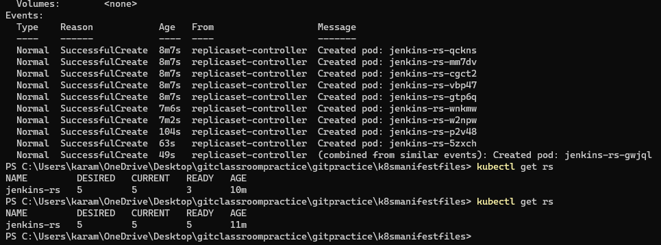

### Kubernetes api resources


### Kuberenetes controllers:

* connect the kubernetes cluster to azure cli
```
 az aks get-credentials --resource-group k8s --name k8scluster
```
### creating pod with
1. nginx
2. nginx & alpine with sleep 1d
3. nginx & alpine with sleep 1d & alpine with sleep 10 sec
4. nginx & httpd with 80 port exposed


### replication controller:
* A ReplicationController is responsible for managing the pod lifecycle and ensuring that the specified number of pods required are running at any given time. 
* If there are too many pods, the ReplicationController terminates the extra pods. If there are too few, the ReplicationController starts more pods. Unlike manually created pods, the pods maintained by a ReplicationController are automatically replaced if they fail, are deleted, or are terminated.
##### replicaset nginx pod without selectors:
```
---
apiVersion: apps/v1
kind: ReplicaSet
metadata:
  name: rsnginx
spec:
  minReadySeconds: 1
  replicas: 3
  template:
    metadata:
      name: rspod
    spec:  
      containers:
        - name: nginx
          image: nginx:1.25
          ports:
            - containerPort: 80
```            

##### replicaset nginx pod with selectors:
```
---
apiVersion: apps/v1
kind: ReplicaSet
metadata:
  name: rsnginx
  labels:
    app: nginx
spec:
  minReadySeconds: 1
  replicas: 3
  selector:
    matchLabels:
      app: nginx
  template:
    metadata:
      name: rspod
      labels:
        app: nginx
    spec:  
      containers:
        - name: nginx
          image: nginx:1.25
          ports:
            - containerPort: 80
```

#### To describe the replicaset
```
kubectl describe rs rsnginx
```

* Now delete all the three pods and then check number of pods

* We can see three new pods created as number of replicasets are 3.
#### we can scale the number of pods using the command
```
kubectl scale --replicas=4 rs/rsnginx
```  

* creating replicaset jenkins with 5 pods & alpine with 1 pod
```
---
apiVersion: apps/v1
kind: ReplicaSet
metadata:
  name: jenkins-rs
spec:
  minReadySeconds: 5
  replicas: 5
  selector:
    matchLabels:
      app: jenkins
  template:
    metadata:
      name: jenkins
      labels:
        app: jenkins
    spec:
      containers:
        - name: jenkins
          image: jenkins/jenkins:lts-jdk11
          ports:
            - containerPort: 8080
        - name: alpine
          image: alpine:3
          args:
            - sleep
            - 1d
```
```
kubectl apply -f rs-jenkins.yaml
```


* now delete one pod and describe replicaset


#### creating nginx pod with label


#### creating a replicaset,service file for nginx and alpine pod
* alpinepod.yaml
```
---
apiVersion: v1
kind: Pod
metadata:
  name: alpine
spec:
  containers:
    - name: alpine
      image: alpine
      command:
        - sleep
        - 1d
```
* nginx-rs.yaml
```
---
apiVersion: apps/v1
kind: ReplicaSet
metadata:
  name: nginx-rs
  labels:
    app: nginx
    layer: web
    version: "1.23"
spec:
  minReadySeconds: 1
  replicas: 2
  selector:
    matchLabels:
      app: nginx
  template:
    metadata:
      name: nginx
      labels:
        app: nginx
        version: "1.23"
    spec:
      containers:
        - name: nginx
          image: nginx:1.23
          ports:
            - containerPort: 80
```
* nginx-svc.yaml
```
---
apiVersion: v1
kind: Service
metadata:
  name: nginx-svc
  labels: 
spec:
  selector:
    app: nginx
  type: ClusterIP
  ports:
    - name: nginx-svc
      port: 80
      targetPort: 80
      protocol: TCP
```
```
kubectl apply -f nginx-svc.yaml
kubectl apply -f alpinepod.yaml
kubectl apply -f nginx-rs.yaml
kubectl get po
kubectl get rs
kubectl get po --show-labels
kubectl get svc -o wide
```


#### create an alpine pod and login into it
```
kubectl exec -it alpine -- /bin/sh
```
* ping nginx-svc by its IP address and acces through web page using curl
```
ping -c 3 10.0.214.250
```


### manifest with loadbalancer
```
---
apiVersion: v1
kind: Service
metadata:
  name: nginx-lb
spec:
  ports:
    - name: nginx-lb
      port: 80
      protocol: TCP
      targetPort: 80
  selector:
    app: nginx
  type: LoadBalancer
```

* To delete svc
```
kubectl delete svc nginx-lb
```
